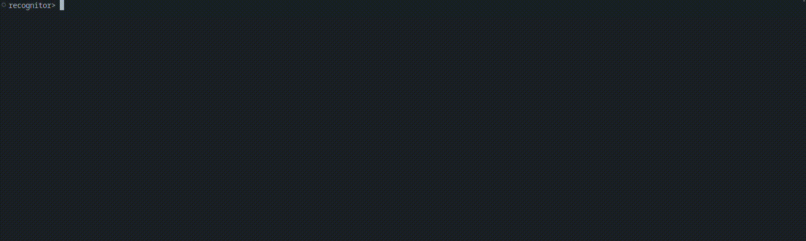

# Introduction

When given a crossword puzzle where you need to search for words horizontally/vertically/diagonally, this tool might be of use.
Make sure to check if the `slicer.sh` has correct pixel-sizing for extracting character-rows from an image to feed to Google
Cloud Vision API.

## Technologies used
1. Python3 script
1. Bash script
1. Google Cloud Vision OCR API

Since Optical Character Recognition in Google Cloud tends to make significant mistakes when being
fed with big image then need to slice the initial row-by-row. When Google scans only one row of the
image then rarely any mistakes are made (couldn't get rid of Google considering 'Õ' as 'Ö' still).
Though- when now feeding row-images to google then significant overhead is introduced by network
traffic and google processing many smaller images one by one.

Images of rows are fed into a matrix and search for words:
1. horizontally W->E,
1. vertically N->S,
1. diagonally to SE,
1. diagonally to NE

# Setup
1. Enable Cloud Vision API service in Google Cloud for your account
1. Create python virtual environment with `python3 -m venv path/to/venv`. **All python or pip related commands from here on need to be prefixed with the virtual `env/bin/` path.**
1. install and initialize google-cloud cli
1. `sudo apt install imagemagick`
1. Omit execute rights to `start.sh` with `sudo chmod u+x start.sh`

# Using the tool
Add your crossword image as `image.jpg` into the root folder of the project, adjust the pixels and repetitions in the `slicer.sh` to match the crossword line sizes and run `<python-virtual-env-path>/bin/python3 recognitor.py`.
